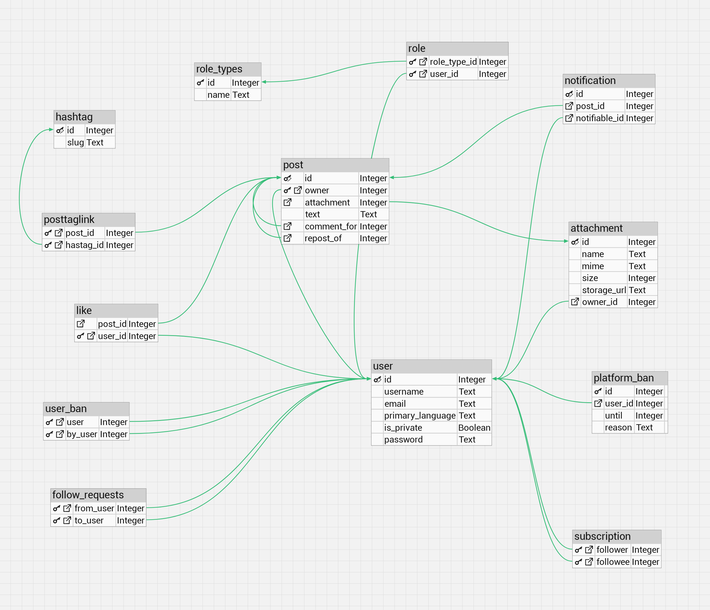

# НИЯУ МИФИ. Лабораторная работа №2-1 - "Пользователи. Роли. Привилегии

> Мищенко Тимофей, Б20-505. 2024

## Диаграмма отношения сущеностей



## Процесс работы

### Определить, в какой схеме находятся таблицы Вашей базы данных

```text
postgres=# SELECT table_schema, table_name
           FROM information_schema.tables
           WHERE table_schema NOT IN ('information_schema', 'pg_catalog')
           AND table_type = 'BASE TABLE';

 table_schema |   table_name
--------------+----------------
 public       | users
 public       | subscription
 public       | post
 public       | attachment
 public       | hashtag
 public       | posttaglink
 public       | follow_request
 public       | user_ban
 public       | notification
 public       | upvote
 public       | role
 public       | role_types
 public       | platform_ban
(13 rows)
```

Все таблички в схеме `public`.

### Следует ли изменить схему? Следует ли создать несколько отдельных схем для выбранной предметной области? Почему?

Смена схемы может потребоваться, если текущая структура не отражает логического разделения данных. Несколько схем могут быть полезны для:

- Изоляции и управления доступом разных пользователей или групп пользователей.
- Организации таблиц по функциональности (например, отдельные схемы для отчетов, архивов, основных данных).
- Упрощения поддержки и развертывания приложений, когда одно приложение использует одну схему (мультитенантность).

В системе Tw3tter нет смысла в смене схемы или создания нескольих схем, так как система монолитна.

### Определить, какие роли нужны для нормального функционирования Вашей базы данных. Какие системные и объектные привилегии потребуются каждой роли? Понадобятся ли вложенные роли?

Для нормального функционирования базы данных, описанной выше, можно определить следующие роли с соответствующими привилегиями:

1. Администратор БД (db_admin): Эта роль требуется для управления всей базой данных, включая создание и удаление таблиц, управление пользователями и ролями, а также настройку прав доступа.

   - Системные привилегии: CREATEDB, CREATEUSER, ALTER, DROP
   - Объектные привилегии: ALL PRIVILEGES на все таблицы

2. Модератор (moderator): Эта роль отвечает за управление контентом и пользователями, включая бан пользователей и управление жалобами. Используется сервисом модерации, к которому имеют доступ модераторы.

   - Объектные привилегии: SELECT, UPDATE, DELETE на таблицы user, user_ban, platform_ban

3. Разработчик (developer): Разработчики могут требовать доступ для создания и изменения структуры таблиц и представлений в процессе разработки.

   - Системные привилегии: CREATE, ALTER
   - Объектные привилегии: SELECT, INSERT, UPDATE, DELETE, ALTER на все таблицы

4. Пользователь приложения (app_user): Эта роль предназначена для сервиса пользовательского интерфейса.

   - Объектные привилегии: SELECT, INSERT, UPDATE на таблицы user, post, subscription, attachment, posttaglink, follow_request, upvote, role

   - По хорошему нужен Row Level Security, но нет :(

5. Аналитик (analyst): Роль аналитика включает высокий уровень доступа для чтения данных, необходимых для анализа и создания отчётов.

   - Объектные привилегии: SELECT на все таблицы

### Создать роли и выдать им необходимые объектные и системные привилегии

Создадим роли:

```sql
-- Очевидно, вот так указывать пароли не нужно :D
CREATE ROLE db_admin WITH LOGIN PASSWORD 'secure_password1';
CREATE ROLE moderator WITH LOGIN PASSWORD 'secure_password2';
CREATE ROLE developer WITH LOGIN PASSWORD 'secure_password3';
CREATE ROLE app_user WITH LOGIN PASSWORD 'secure_password4';
CREATE ROLE analyst WITH LOGIN PASSWORD 'secure_password5';
```

Назначим системные привилегии:

```sql
ALTER ROLE db_admin WITH SUPERUSER CREATEDB CREATEROLE;
ALTER ROLE developer WITH CREATEDB;
-- Другие роли не получают системные привилегии, поскольку их задачи ограничиваются объектным уровнем
```

Назначим объектные привилегии:

```sql
-- Для db_admin предоставим все привилегии на все таблицы
GRANT ALL PRIVILEGES ON ALL TABLES IN SCHEMA public TO db_admin;

-- Для moderator предоставим права на изменение и удаление данных в определенных таблицах
GRANT SELECT, UPDATE, DELETE ON TABLE public.user, public.user_ban, public.platform_ban TO moderator;

-- Для developer предоставим права на создание и изменение структур данных
GRANT ALL PRIVILEGES ON ALL TABLES IN SCHEMA public TO developer;
GRANT ALL PRIVILEGES ON ALL SEQUENCES IN SCHEMA public TO developer;
GRANT USAGE, CREATE ON SCHEMA public TO developer;

-- Для analyst предоставим права на чтение всех таблиц
GRANT SELECT ON ALL TABLES IN SCHEMA public TO analyst;

-- Для app_user предоставим базовые права на вставку и чтение определенных таблиц
GRANT SELECT, INSERT ON TABLE public.post, public.subscription, public.follow_request, public.upvote TO app_user;
```

### Проверить по представлению системного каталога `pg_catalog.pg_roles`,что все нужные роли были созданы и обладают корректным набором привилегий

Проверим системные привилегии:

```text
postgres=# SELECT rolname, rolsuper, rolcreatedb, rolcreaterole, rolcanlogin
           FROM pg_roles
           WHERE rolname IN ('db_admin', 'moderator', 'developer', 'app_user', 'analyst');

  rolname  | rolsuper | rolcreatedb | rolcreaterole | rolcanlogin
-----------+----------+-------------+---------------+-------------
 moderator | f        | f           | f             | t
 app_user  | f        | f           | f             | t
 analyst   | f        | f           | f             | t
 db_admin  | t        | t           | t             | t
 developer | f        | t           | f             | t
(5 rows)
```

Проверим привилегии для таблиц:

```text
postgres=# SELECT grantee, table_schema, table_name, privilege_type
           FROM information_schema.table_privileges
           WHERE grantee IN ('db_admin', 'moderator', 'developer', 'app_user', 'analyst') ORDER BY RANDOM() LIMIT 10;

  grantee  | table_schema |   table_name   | privilege_type
-----------+--------------+----------------+----------------
 developer | public       | follow_request | UPDATE
 analyst   | public       | attachment     | SELECT
 developer | public       | posttaglink    | TRUNCATE
 db_admin  | public       | hashtag        | SELECT
 developer | public       | role_types     | TRUNCATE
 db_admin  | public       | hashtag        | REFERENCES
 db_admin  | public       | posttaglink    | TRUNCATE
 developer | public       | role_types     | REFERENCES
 moderator | public       | platform_ban   | UPDATE
 app_user  | public       | upvote         | INSERT
(10 rows)
```

(Результат длинный, выбрал рандомное подмножество, но проверил руками что все хорошо по полной).

### Попробовать подключиться от лица каждой роли (из тех, которым разрешено подключение к серверу БД). Убедиться, что роль имеет доступ к разрешенным данным и не имеет доступа ко всем остальным.

db_admin:

```text
❯ psql -U db_admin -d postgres -h localhost
Password for user db_admin:
psql (16.1)
Type "help" for help.

postgres=# CREATE TABLE test_table (id SERIAL PRIMARY KEY, test_column TEXT);
CREATE TABLE
postgres=# SELECT * FROM user LIMIT 10;
   user
----------
 db_admin
(1 row)

postgres=# SELECT * FROM users LIMIT 10;
 id |     username     |         email          | primary_language | is_private |  password
----+------------------+------------------------+------------------+------------+------------
  1 | Pink_Mammoth     | P.Mammoth@gmail.com    | fr               | t          | 7fj0j1huny
  2 | Airborne_Eel     | A.Eel@hotmail.com      | it               | t          | 2cv6dlwbl3
  3 | Silver_Shark     | S.Shark@protonmail.com | en               | f          | vw839tjhxh
  4 | Running_Inchworm | R.Inchworm@gmail.com   | it               | t          | 2jysbjjtqn
  5 | Northern_Frill   | N.Frill@hotmail.com    | es               | f          | 2cd2blvqaa
  6 | Lost_Agama       | L.Agama@gmail.com      | pl               | t          | wmuhi09bmv
  7 | Dirty_Buzzard    | D.Buzzard@hotmail.com  | fr               | t          | qoafeqs4bb
  8 | Bastard_Ant      | B.Ant@protonmail.com   | pl               | f          | kufkmcp8gl
  9 | Rabid_Firefly    | R.Firefly@outlook.com  | de               | t          | 5rxg6mqjpv
 10 | Machinegun_Frog  | M.Frog@outlook.com     | es               | f          | v75ixvunr2
(10 rows)
```

Имеет право на все.

moderator:

```text
❯ psql -U moderator -d postgres -h localhost
Password for user moderator:
psql (16.1)
Type "help" for help.

postgres=> SELECT * FROM users LIMIT 10;
 id |     username     |         email          | primary_language | is_private |  password
----+------------------+------------------------+------------------+------------+------------
  1 | Pink_Mammoth     | P.Mammoth@gmail.com    | fr               | t          | 7fj0j1huny
  2 | Airborne_Eel     | A.Eel@hotmail.com      | it               | t          | 2cv6dlwbl3
  3 | Silver_Shark     | S.Shark@protonmail.com | en               | f          | vw839tjhxh
  4 | Running_Inchworm | R.Inchworm@gmail.com   | it               | t          | 2jysbjjtqn
  5 | Northern_Frill   | N.Frill@hotmail.com    | es               | f          | 2cd2blvqaa
  6 | Lost_Agama       | L.Agama@gmail.com      | pl               | t          | wmuhi09bmv
  7 | Dirty_Buzzard    | D.Buzzard@hotmail.com  | fr               | t          | qoafeqs4bb
  8 | Bastard_Ant      | B.Ant@protonmail.com   | pl               | f          | kufkmcp8gl
  9 | Rabid_Firefly    | R.Firefly@outlook.com  | de               | t          | 5rxg6mqjpv
 10 | Machinegun_Frog  | M.Frog@outlook.com     | es               | f          | v75ixvunr2
(10 rows)

postgres=> CREATE TABLE test_table2 (id SERIAL PRIMARY KEY, test_column TEXT);
ERROR:  permission denied for schema public
LINE 1: CREATE TABLE test_table2 (id SERIAL PRIMARY KEY, test_column...
                     ^
postgres=> select * from attachment;
ERROR:  permission denied for table attachment
```

developer:

```text
❯ psql -U developer -d postgres -h localhost
Password for user developer:
psql (16.1)
Type "help" for help.

postgres=> CREATE TABLE test_table3 (id SERIAL PRIMARY KEY, test_column TEXT);
CREATE TABLE

postgres=> CREATE ROLE test_role;
ERROR:  permission denied to create role
DETAIL:  Only roles with the CREATEROLE attribute may create roles.
```

analyst:

```text
❯ psql -U analyst -d postgres -h localhost
Password for user analyst:
psql (16.1)
Type "help" for help.

postgres=> SELECT id, owner, attachment from post limit 10;
 id | owner | attachment
----+-------+------------
  1 |     1 |
  2 |     1 |
  3 |     1 |
  4 |     1 |          1
  5 |     1 |          2
  6 |     1 |
  7 |     1 |          3
  8 |     1 |          4
  9 |     1 |
 10 |     1 |
(10 rows)

postgres=> INSERT INTO users (username, email, primary_language, is_private, password) VALUES ('test', 'test@example.com', 'English', false, 'pass');
ERROR:  permission denied for table users
```

## Заключение

Изучены механизмов баз данных, связанных с управлением возможностями пользователей.